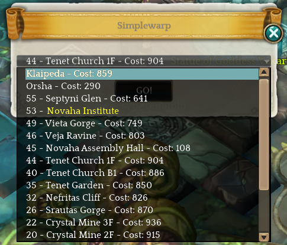

# Tree of Savior Addons
This is an addon repository for Tree of Savior.

## Addons

### SimpleWarp

This addon replaces the original warp map with a simpler menu with a list of warps.

#### Features

- Shows the level of the warp location
- Orders the locations by:
    1. City
    2. Highest level locations
- When on a <b>Field</b> map, pre-selects the lowest cost city</li>
- When on a <b>City</b> map, pre-selects the last field map you warped from</li>

## Download / Installation
These addons should be installed via the [Excluron's Addon Manager](https://github.com/Excrulon/Tree-of-Savior-Addon-Manager).